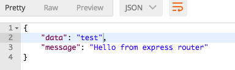

# Minimalist express/typescript clean boilerplate
- This is an [express](https://expressjs.com/) boilerplate based on [TypeScript](https://www.typescriptlang.org/),
you can clone it and start coding
- Cover [SOLID](https://en.wikipedia.org/wiki/SOLID_(object-oriented_design)) principles
## What this includes? 
  * TypeScript compiler
  * [Express](https://expressjs.com/)
  * [Nodemon](https://nodemon.io/) watcher (hot reload)
  * Active sourcemap for debugging
  * [TS-lint](https://palantir.github.io/tslint/)
  * [ES6](http://es6-features.org/) support
  * [Mongoose](http://mongoosejs.com/) ORM
  * [MongoDB](https://mongodb.com/) connection
  * Multiple env
  * Basic CRUD
  
  ## How to start?
  1. Clone the repo `git clone https://github.com/binaryk/node-ts-boilerplate.git`
  2. `cd` to the working directory
  3. Run `yarn` or `npm install`
  4. Run `npm install -g tsc` (to install globally typescript transpiler)
  5. [Install MongoDB](https://docs.mongodb.com/manual/installation/) and run it (`mongod`)
  6. Run `npm watch` - to watch your file updates
  7. Open [postman](https://www.getpostman.com/) and try `GET: http://127.0.0.1:3000/sample`, you will receive:
  
  8. Add your MongoDB configuration in `src/config/database.ts`
  7. Add your own routes in `src/routes`
  8. Add your own controllers in `src/controllers`
  9. Add your own models in `src/models`
  10. Enjoy development
   
  ## Group routes and define middleware
   - For CRUD `contact` instance you can use the `group` wrapper
   - Add prefix with middleware keys to the routes group like this:
  
```javascript
        this.Route.group({
            prefix: 'contact',
            middleware: 'auth'
        }, (router) => {
            router.post('', this.contactController.store);
            router.get(':contactId', this.contactController.getContactWithID);
            router.get('', this.contactController.getContacts);
            router.post('', this.contactController.store);
            router.put(':contactId', this.contactController.updateContact);
            router.delete(':contactId', this.contactController.deleteContact);
        })
```
### Add custom middleware
I. You have two options to define an middleware in config, one is to declare callback function directly and 
second one, in `/src/http/middleware*` you can add your file with middleware here.
Bellow we have an example of an empty middleware:
```javascript
export class Authenticate {
    constructor () {
    }

    public handle(req, res, next) {
        console.log('Authenticate middleware - check if is authenticated');
        next();
    }
}

```
| ⌘ | The **handle** method is required!

II. Declare it in `src/config/middleware.ts`
```typescript
export const routesMiddleware = {
    auth: Authenticate,
    session: (req, res, next) => {
        console.log('Local definition');
        next();
    }
};
```
III. In the `Route` definition, just add the key of the middleware, like this:
```typescript
     this.router.group({
            middleware: 'auth'
        }, (router) => {
```
Or you can use an array of middlewares: 
```typescript
middleware: ['auth', 'session']
```
IV. Also you can define these two middlewares in a middleware group:
``` 
export const groupsMiddleware = {
    web: [
        StartSession,
        Authenticate
    ]
};
```
And use it like: 
``` this.router.group({
       prefix: 'group',
       middleware: ['web']
 }, r => {
```
V. You can send arguments to the middleware functions from the definition:
```typescript
 this.router.group({
            prefix: 'group',
            middleware: 'auth:admin,user'
        }, r
```
- Now I can get my arguments as an array like: ['admin', 'user'] in the `auth` middleware, BUT,
there you should implement `encapsulate` function, not the `handle` one:
```typescript
    public encapsulate(args) {
        return (req, res, next) => {
            console.log(args, 'Encapsuleted arguments from the route');
            next();
        };
    }
```
### Add global middlewares
 - In `config/middlewares.ts` we have an array for global middleware definitions, allow format is a class with handle function
 or a simple callback function:
 ```typescript
export const middleware = {
    'body-parser': bodyParser.json(),
    'url-encoded': bodyParser.urlencoded({ extended: false })
};
```
## Use [express router](https://expressjs.com/en/guide/routing.html) as default
- In your [route definition](https://github.com/binaryk/node-ts-boilerplate/blob/master/src/routes/Contact.ts) just use it through `this.Route`:
```typescript
 this.router.get('/sample', (req, res, next) => {
            res.json({
                'data': 'test'
            });
        });
```
