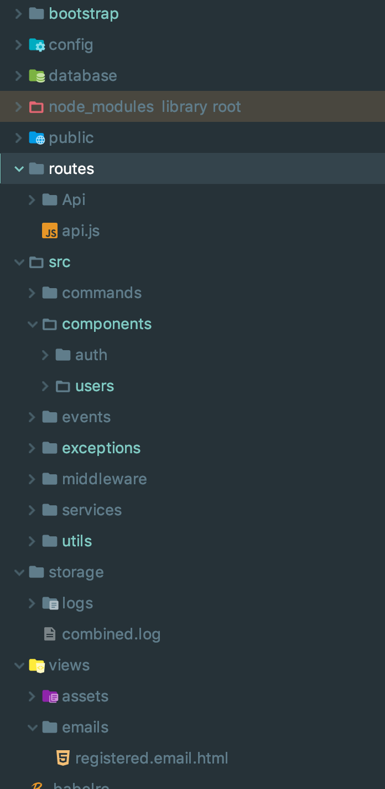

# Starter Node + Express + Typescript + PostgreSQL API

## Project structure

### This architecture follows [node best practices](https://github.com/i0natan/nodebestpractices) principles

## Folder structure

### The solution is organized by self-contained components not by technical role

1. `bin` - sh scripts for CI/CD
1. `bootstrap` - application setup (server listener, express router and database connector)
1. `config` - index returns config from a `environments/*` based on `process.env.NODE_ENV`. The database env config is get separately from the `database` file.
1. `database` - migrations and seeds generated by sequelize (see `.sequelizerc`)
   In this folder we can add the others configurations (like `email.js`)
1. `public` - unsecured public shared files (like `docs/*.png`)
1. `routes` - all files from the `routes/Api/v1/*` will be read automatically and used as entry points into the application
1. `src` - this includes all the project business logic
    - `commands` - e.g. `import_data.js` command
    - `components` - all CRUD entities, and build modules (`auth`)
    - `components/users` - example of CRUD entity with all possible services:
        - `UserMdel` - model
        - `UserPolicy` - used for checking if logged user has access to perform CRUD actions over the entity
        - `UserRequest` - used for validation controllers payload (`req.body`) with `joi`
        - `UsersController` - request interceptors (handlers for routes)
        - `UsersRepository` - DAL layer - will inject Model for getting data from the database. This layer can be ommited, but for huge DAL logic, the suggestion is to keep it there and make that logic into this file.
        - `UsersService` - this should be injected into controller, and used for all business logic. The data passed here from the contorllers should not be the whole `req`, but preformatted (or `req.body`)
    - `events` - global events bus
    - `exceptions` - custom Errors
    - `middleware` - custom middleware (group of middlewares)
    - `services` - external (not related to the CRUD operations) services (e.g. `EmailSenderService`)
    - `utils` - helpers and reusable common logic (e.g. dateFormat)
1. `storage` - store secure files
    - `logs` - `winston` will keep here application logs
1. `views` - templates (e.g. for emails)
    - `assets` - css/scss for templates

## Tech

1. NodeJS
2. TypeScript
   3.. Express
3. PostgreSQL
4. ES6

## Local setup

1. `git clone`
2. `yarn install` or `npm install`
3. `config/database` - put database local configurations
4. `yarn dev` - this will run project in watch mode
5. `yarn migrate`

## This includes

-   Typescript setup
-   PostgreSQL setup
-   Multiple env
-   ts-lint and prettier with pre commit hook with husky
-   CRUD over users
-   Auth module
-   Passport Authentication
-   Middleware
-   i18next
-   Files uploader
-   Mail provider (mailtrap used for testing)
-   Example of sending email and store files with resizing and optimization functionality
-   Heroku heroku-postbuild scripts
-   PM2 cluster setup
